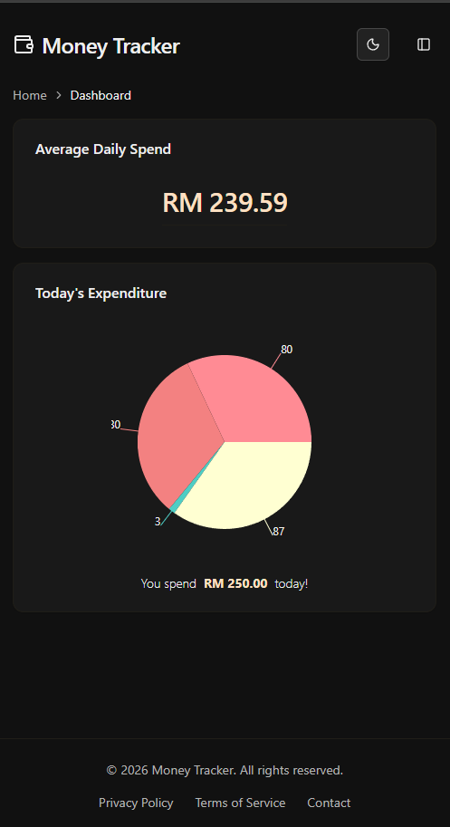
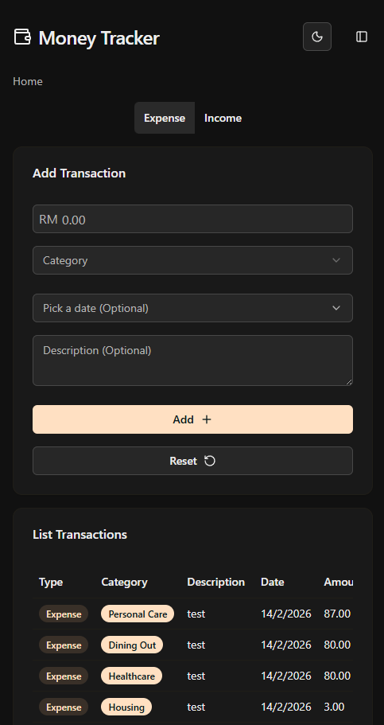
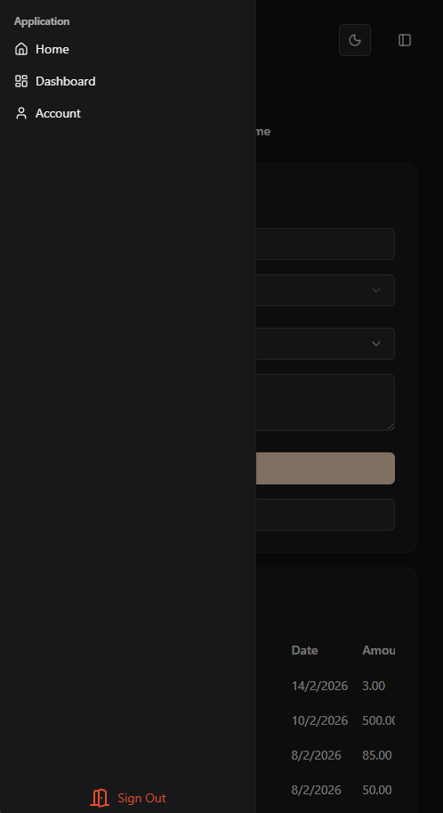
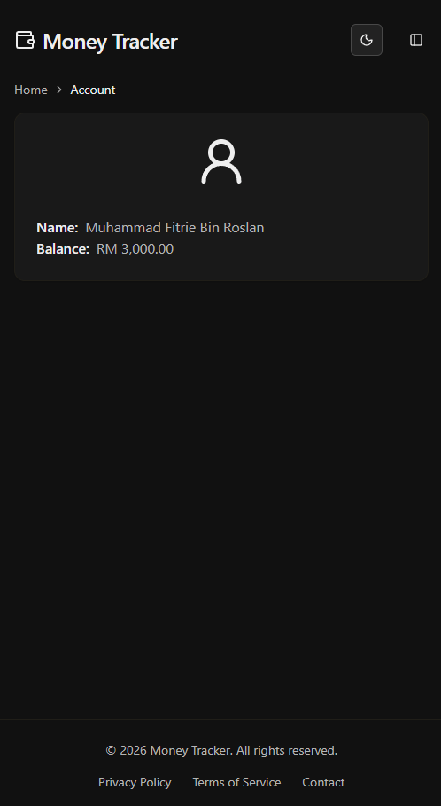

# 💰 Money Tracker

## 📌 About

Money Tracker is a simple web app that helps me track my daily expenditure.  
It allows me to monitor where my money goes and manage spending more easily.

## 🏠 Hosting

This app is hosted on my personal Ubuntu home server.

## 🧰 Tech Stack

- Kubernetes
- PostgreSQL
- Next.js
- Go (Golang)

## 🚀 Features

- Track daily expenses
- Simple and clean interface
- Self-hosted for full control

## 📷 Screenshot

<!--  -->

  
  
  
  

## 📄 License

Personal project.
